# Práctica 4. Desactivando mi bomba

## Mi código

### Contraseña

Voy a empezar explicando como he encriptado la contraseña. En primer lugar la declaro como es obvio de la siguiente manera, escondiendo la contraseña real dentro de los carácteres.

    char password[]="cmeaoepoeijftafasenet\n";

Para desencriptarla y compararla he creado el siguiente método

~~~
int checkPassword(char *c){
    int i = 0 ;
    int counter = 0;
    char finalPass[8];

    finalPass[0] = password[0];
    finalPass[1] = password[3];
    finalPass[2] = password[6];
    finalPass[3] = password[9];
    finalPass[4] = password[12];
    finalPass[5] = password[15];
    finalPass[6] = password[18];

    if ( finalPass[0] == c[0] && finalPass[1] == c[1] && 
         finalPass[2] == c[2] && finalPass[3] == c[3] && 
         finalPass[4] == c[4] && finalPass[5] == c[5] && 
         finalPass[6] == c[6]  ){
             return 1;
         }else {

            return 0;
         }
}
~~~

Como vemos declaro mi finallPass la cual va a ser los carácteres 0, 3, 6,9 12, 15 y 18 de mi contraseña. Siendo esta 'capitan'.     

Para comprobar si la contraseña es correcta o incorrecta se podría haber realizado un strncmp, se realiza comprobando carácter a carácter simplemente para despistar al posible hacker.

### Código PIN

Simplemente vamos a realizarle una operación aritmética sobre el pin original, dividiendolo por 2 y sumandole 25.

~~~
int checkPin(int number){

    passcode = (passcode / 2 ) + 25 ; //----> 5025
    
    if ( number != passcode){
        return 0;
    }

    return 1;

}
~~~

## Desactivar la bomba

Vamos a proceder a desactivar la bomba, para ello lo primero que debemos es poner un break point en el comienzo de la función main y analizar.

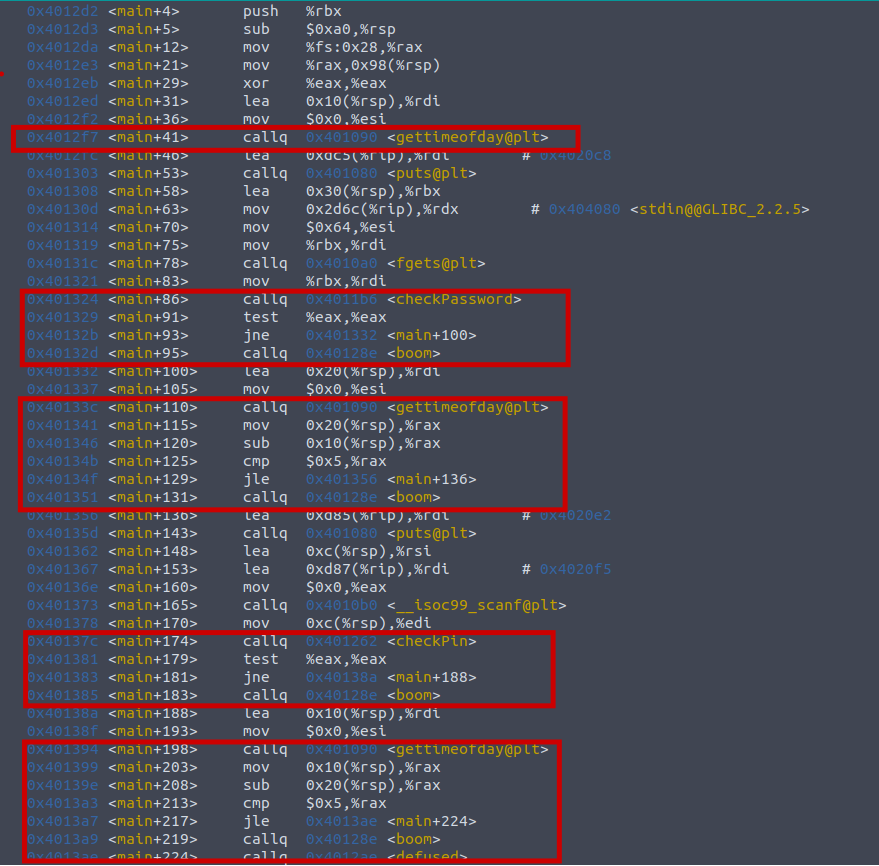

Lo primero que debemos observar es situar un brekapoint en main y observar las llamadas que hacen explotar nuestra bomba y las ordenes que la preceden. 

Podemos diferenciar 4 llamadas a *boom*: 

### Primera llamada
La primera llamada se realiza en main+95 y se efectua justo después de realizarse la llamada a checkPassword. 

    ~~~
    callq  4011b6 <checkPassword>
    test   %eax,%eax
    jne    401332 <main+0x64>
    callq  40128e <boom>
    ~~~

Para saltarnos este paso vamos a valernos de las dos instrucciones máquinas que se realizan antes. En $eax se ha guardado el return de la llamada a checkPassword y el el test hara saltar el jne solo si el test anterior no son iguale, no es cero o si ZF esta desactivada. 

Situamos un breakpoint en main+91, y con el comando nexti nos situamos en esta parte del programa.

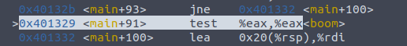

Vamos a modificar el valor de eax, para ello ejecutamos.

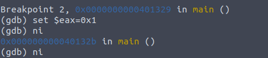

Y podemos observar que hemos saltado la primera invocación.

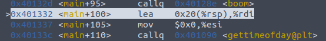

### Segunda llamada

La segunda llamada se realiza en main+131 y se efectua tras una llamada a gettimeofday.

~~~
callq  401090 <gettimeofday@plt>
mov    0x20(%rsp),%rax
sub    0x10(%rsp),%rax
cmp    $0x5,%rax
jle    401356 <main+0x88>
callq  40128e <boom>
~~~

Al igual que en la primera llamada, observamos que justo antes de la llamada a boom se efectua una comparación JLE la cual salta si es menor o igual. El salto se realiza si ZF 0 1 o si SF es diferente de OF. Lo que vamos a hacer de nuevo es valernos de que podemos cambiar el valor de los registros cuando queramos y vamos a cambiar el valor de rax para que cumpla dichas condiciones justo antes de la llamada.

Situamos un breakpoint en la llamada

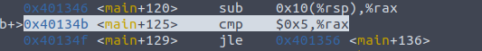

Cambiamos el valor de rax para que cumpla la comparativa

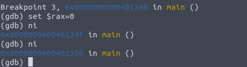

Observamos que efectivamente, salta a la llamada boom

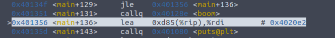

### Tercera llamada

La tercera llamada se realiza en main+183 y va precedida de una llamada al método checkPin. 

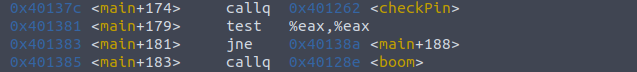

Vuelve a repetirse el mismo patrón que en las anteriores llamadas, en este caso se produce la misma secuencia que se producía en la primera llamada, por lo que para saltarnos nuestra indeseada explosión vamos a operar de la misma manera.

Situamos un break point justo en la comparación

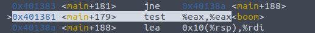

Cambiamos el valor de eax y proseguimos

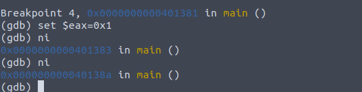

Observamos que hemos pasado la llamada con éxito

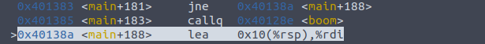

### Última llamada, la salvación

La última llamada a la bomba se produce en la linea main+219. y observamos que se realiza siguiendo el mismo patrón que en la segunda llamada.

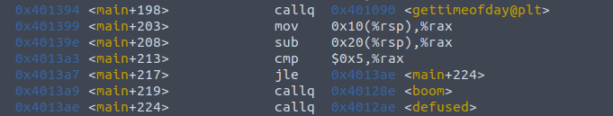

Vamos a seguir el mismo patrón de nuevo. Situamos nuestro breakpoint.

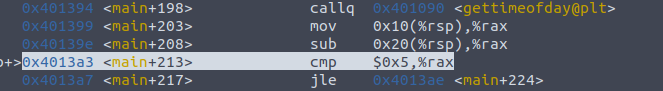

Cambiamos el valor de rax para que cumpla el condicional.

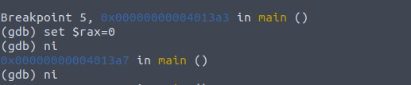

Y lo que una vez fue un sueño se cumple.

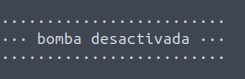

## En busca de las claves

### Contraseña

Lo primero que vamos a hacer para intentar averiguar donde se almacena nuestra contraseña será buscar en el método donde puede estar, si no conocieramos nuestro código solo habría dos candidatos, los que no son precedidos por gettime. Vamos a mirar en el primero, curiosamente se llama checkPassword.

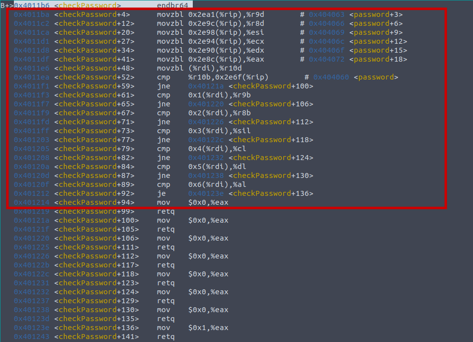

Si observamos las primeras líneas observamos un patrón interesante, si no conocieramos nuestro código saltaría a la vista que se van almacenando posiciones de memoria saltando de 3 en 3.

~~~
  movzbl 0x2e8a(%rip),%r9d        # 404063
  movzbl 0x2e85(%rip),%r8d        # 404066
  movzbl 0x2e81(%rip),%edi        # 404069 <password+0x9>
  movzbl 0x2e7d(%rip),%esi        # 40406c <password+0xc>
  movzbl 0x2e79(%rip),%ecx        # 40406f <password+0xf>
  movzbl 0x2e75(%rip),%eax        # 404072 <password+0x12>
  movzbl (%rdx),%r10d
~~~

Vamos a observar entonces que tienen nuestras posiciones de memoria una vez realizados todos estos movimientos por el compilador. Para ello con nexti nos situamos despues de dichas operaciones.

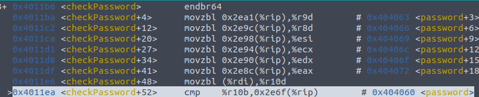

Y ahora vamos a evaluar cada posición de memoria.

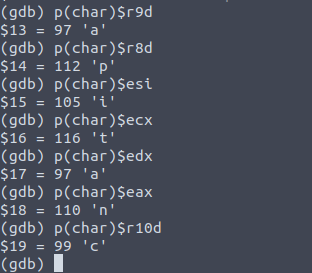

Esto nos da los carácteres con los que se forman la contraseña "A P I T A N C" pero podría el programador podría haber cambiado el orden de estos a la hora de comprobarlos. La mejor manera de averiguarla entonces va a ser encontrar el patrón. Como observamos en la imagen, los carácteres van saltando de 3 en 3 en posiciones de memoria. Si jugamos un poco con los registros observamos que a partir de la posicion de memoria 0x404060 encontramos lo siguiente:

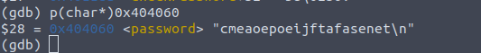

Y si a este texto le aplicamos el patrón observado, encontramos que vamos obtener una palabra la cual tiene bastantes probabilidades de ser nuestra password

    C me A oe P oe I jf T af A se N et ===> CAPITAN

### Código Pin

Lo primero que vamos a hacer, al igual que a la hora de averiguar la contraseña va a ser ver los posibles registros donde se pueda almacenar. Para ello vamos a observar el código del método que se ejecuta después de introducir nuestro pin.

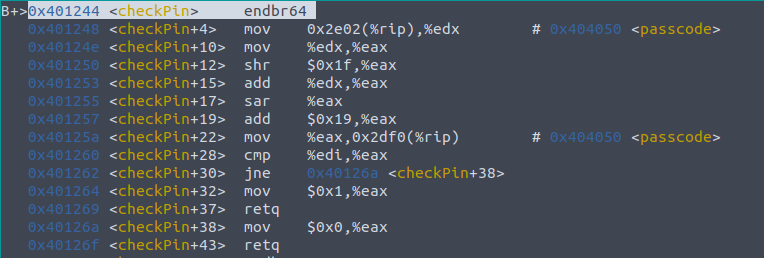

Lo que observamos es que aunque se realizan varías operaciones aritméticas sobre el registro que se va a comparar, $eax, no importan porque hay un momento en la ejecución que se va a comparar con el parámetro que hemos pasado, $edi. Por tanto basta con situarnos sobre dicha comparación y observar el estado del registro $eax en ese momento.

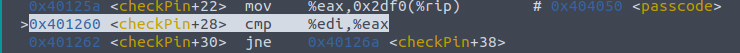

Imprimimos el valor de $eax en este momento

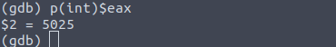

Y ya hemos conseguido nuestro pin. También lo observamos en los registros en la parte superior.

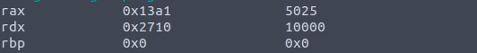

