# Bomba Ana Vico

## Llegando hasta el final

Lo primero que vamos a hacer va a ser poner un punto de ruptura en main y ver los posibles puntos del código donde la bomba haría explosión.

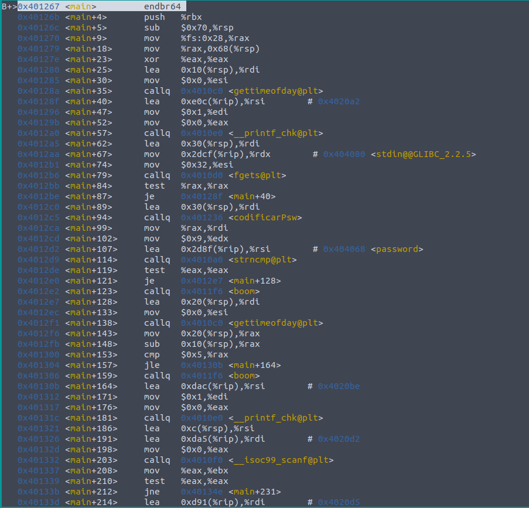

En este primer paso observamos las dos primeras veces que se llama a un método que se llama boom. Para comprobar que este es el método que hace explotar la bomba basta con ir instrucción a instrucción y cerciorarnos.

Una vez tenemos claro que esta es la función a evitar, ponemos varios puntos de ruptura en las comparaciones que preceden a este método. 

### Primer salto

El primer punto de ruptura se va a situar en la línea main+119. Vamos a poner un punto de ruptura en esa línea, ejecutar el programa e introducir cualquier contraseña.

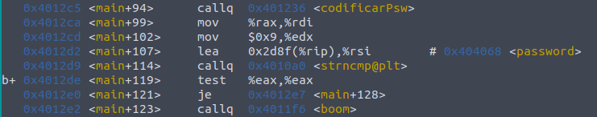

Observamos la comparación que se realiza justo antes, como ya sabemos, je va a comprobar tanto que sean iguales como las flags. Para desactivarla y que no se ejecute la llamada al método ejecutamos:

    set $eax=0

De esta forma hemos saltado la primera llamada a boom. 

### Segundo salto

Si observamos ahora las siguientes instrucciones:

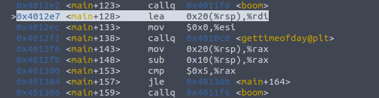

Observamos que la siguiente llamada se efectua tras una comprobación de tiempo. Y que la comparación es del tipo JLE.\
Vamos a poner un poner un punto de ruptura en main+153 y cambiar el valor del registro $rax para que no se ejecute y haga explosión. Para ello, una vez en esta instrucción ejecutamos:

    set $rax=0

### Tercer salto

Volvemos a mirar las instrucciones que tenemos por delante:

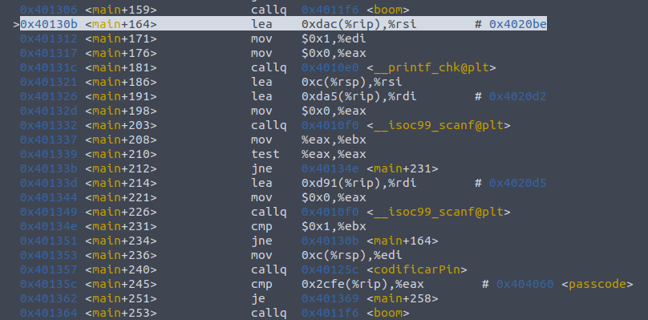

Rápidamente nos damos cuenta de que la siguiente llamada a boom se realiza después de llamar al método codificarPin, el cual será llamado después de que introduzcamos uno al azar y del que nos ocuparemos más tarde. \
Vamos a introducir un pin al azar y poner un punto de ruptura en la línea main+245:

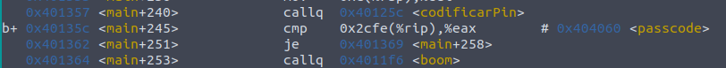

Si observamos los valores de los registros en este punto:

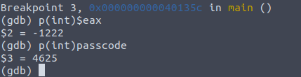

La comparación que se realiza es JE, por lo que para saltarnos la llamada a *boom* vamos a igualar los registros, para ello ejecutamos:

    set $eax=4625

4625 es el valor del pin encriptado. Una vez igualado saltamos la llamada sin problemas.

### Último salto

Nos enfrentamos ahora a la última comprobación:

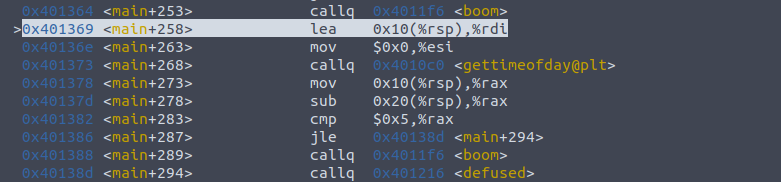

Pero es una comproación que ya conocemos bastante bien y vamos a saltarla como siempre. El proceso será poner un punto de ruptura en la comparación en la línea main+228 y ejecutar 

    set $rax=0

Una vez hecho esto comprobamos que la bomba ha sido desarmada con éxito.

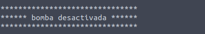

## Descubriendo las claves

### Algoritmo de encriptación de la contraseña

Para descubir la contraseña, lo primero que debemos hacer es averiguar que le pasa a la contraseña que escribimos, como se transforma. Para ello seguimos la pista de los registros donde se almacena y nos damos cuenta de que la transformación se realiza en el método *codificarPsw* 

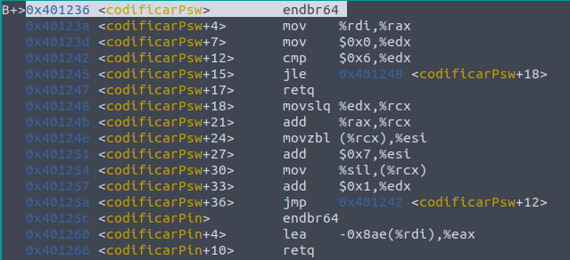

Observamos claramente que existe un bucle que se va a repetir 6 veces. Aunque a simple vista observamos que en cada iteración se van a sumar 7 unidades al registro $esi, para asegurar nuestra teoría vamos a observar como se transforma nuestra contraseña antes y despues de las 6 iteraciones.\
 Cuando empieza el método:

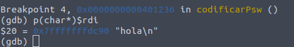

 Tras 4 iteraciones:

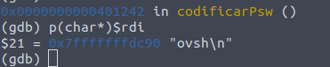

    h   o   l   a
    |   |   |   |
    o   v   s   h

Basta abrir una tabla con los valores ascii y observamos que efectivamente, el algoritmo de encriptación funciona añadiendo a cada caracter 7 unidades.

### Descubriendo la contraseña

Una vez descubierto el algoritmo de encriptación debemos encontrar donde se compara nuestra contraseña, de este modo encontraremos contra qué se esta comparando, aplicarle el algoritmo inverso y descubrir la contraseña.

Si seguimos la pista a las instrucciones:

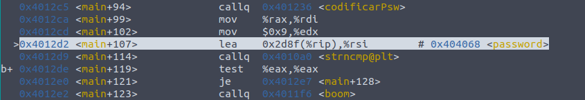

Nos damos cuenta rápidamente que la dirección de memoria donde se guarda la contraseña encriptada es 0x404068. Si miramos el contenido de dicha dirección:

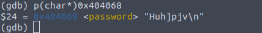

Para descifrar la contraseña abrimos una tabla con los valores ascii, y vamos restando a cada valor 7 unidades:

    H   u   h   ]   p   j   v
    |   |   |   |   |   |   |
    A   n   a   V   i   c   o

Para comprobar que la contraseña es AnaVico, ejecutamos de nuevo el programa y comprobamos que efectivamente saltamos la primera llamada al método *boom*

### Algoritmo de encriptación del Pin

Para averiguar el algoritmo de encriptación vamos a seguir el mismo proceso que hemos seguido para la contraseña, este proceso esta vez nos lleva al método *codificarPin*:

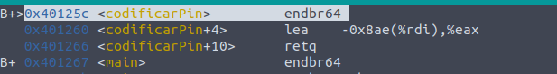

Esta vez nos encontramos con una única operación aritmética sobre nuestro pin:

    lea     -0x8ae($rdi),%eax

Esta operación va a restar 2222 al valor escrito y retornarlo. 
Podemos comprobarlo escribiendo un pin cualquiera, 1000 para el ejemplo y viendo la transformación que sufre, la cual debería dejar el resultado final en $eax y un valor de −1222.

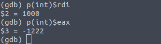

### Encontrando el pin

Ahora que sabemos como funciona el algoritmo de encriptación debemos encontrar la instrucción donde se comparan ambos pines y realizarle el algoritmo contrario, sumarle 2222.

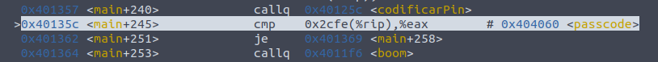

Si miramos que contenido tiene passcode en esta instrucción

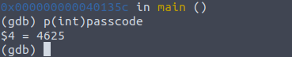

Nuestro pin entonces debe ser 

    4625 + 2222 = 6847

Lo comprobamos 

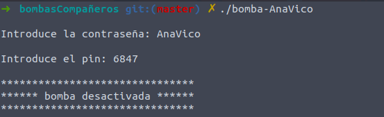