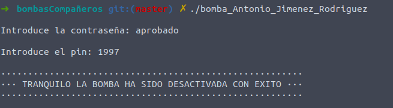

# Bomba Antonio Jimenez Rodriguez

## Llegando hasta el final

Lo primero que vamos a hacer va a ser poner un punto de ruptura en main y ver los posibles puntos del código donde la bomba haría explosión.

### Primer salto
Observamos una posible función que haría explotarla, pero para estar seguros vamos a hacer que explote yendo instrucción a instrucción para cerciorarnos. 
Una vez nos hemos cerciorado de hasta que punto somos capaces de llegar instrucción a instrucción e identifaco la función que hace explotar la bomba,*esta_funcion_no_hace_explotar*, vamos a saltarnos este primer paso como ya hemos hecho anteriormente. Para ello situaremos un punto de ruptura en la línea main+130, ejecutaremos el programa e introduciremos cualquier contraseña.

Observamos la comparación que se realiza justo antes, como ya sabemos, je va a comprobar tanto que sean iguales como las flags. Para desactivarla y que no se ejecute la llamada al método ejecutamos:

    set $al=0

### Segundo salto

Ahora debemos observar detenidamente las siguientes líneas de código y vemos que se vuelve a llamar al método *"esta_funcion_no_hace_explotar"* en la línea main+170 y unas líneas antes se llama a *gettimeofday*. Esto nos indica que se hace alguna comprobación de tiempo. 

Pero nosotros ya estamos curtidos en estas batallas y sabemos como saltarnos este tipo de comprobaciones. Para ello vamos a poner un break point en la línea main+164, justo donde se realiza la comprobación de cuyo resultado depende que se ejecute o no el método *esta_funcion_no_hace_explotar*. La comprobación es del tipo jle, jump less equal, para saltarnos vamos a establecer el valor de $rax a 0 con el siguiente comando

    set $rax=0

Y como observamos, hemos saltado la llamada al método.

### Tercer salto

De nuevo, volvemos a mirar el código que tenemos ahora por delante, y observamos que la siguiente llamada a la bomba se realiza en la línea main+267 y va precedida de otra llamada a *otra_funcion_insignificante* que aún no sabemos que realiza y de, obviamente la llamada a introducir el pin. Siguiente instrucción a instruccion, introducimos un pin cualquier y nos situamos sobre la comprobación importante que hará que se ejecute o no la bomba.

Observamos que esta vez la comprobación es un jump equal y la comparación se realiza sobre $0xfb8 y $eax. Vamos a comprobar los valores de cada uno de estas direcciones.

Todo nos hace indicar que el valor encriptado del registro es 4024, más tarde nos centraremos en esto para intentar averiguar el pin original, por ahora vamos a igualar los registros ejecutando el siguiente comando:

    set $eax=4025

Y comprobamos una vez más que hemos avanzado un paso hacia la gloria.

### Último salto

Observamos lo que nos queda de código para llegar al final y vemos que resta sólo una comprobación temporal exactamente igual que la efectuada en el segundo salto. 

Vamos a proceder a cambiar el valor del registro $rax en el momento de la comprobación, puesto que es exactamente lo mismo vamos a comprobar que efectivamente una vez realizado la bomba ha sido desactivada:

## Descubriendo las claves
### Descifrando el algoritmo
El primer paso que vamos a hacer para tratar de descubrir la contraseña será tratar de averiguar como ha sido encriptada. Para ello vamos a seguir la pista a la contraseña que nosotros escribimos y que métodos se llaman después de que lo hagamos. 
Introducimos como contraseña "hola" y observamos que el siguiente método es *funcion_insignificante*. Vamos a echarle un ojo:

A simple vista observamos el patrón de un bucle que se repite, con una comparación y el add $0x1 final. Para ver qué es lo que realmente está pasando vamos a observar como cambian los registros al principio y al final de la ejecución.

Antes de empezar el bucle comprobamos el valor de $rcx y $rdi

Despúes de ejecutar la primera vuelta al bucle nos damos cuenta de lo siguiente.

Dentro del bucle se va añadiendo 1 al registro eax, y después se ejecutan las siguientes líneas de código, en la cual apreciamos la suma de $rdi, donde esta nuestro registro con $rcx justo después de hacer una operación con $eax.

        mov    $0x0,%eax
        movslq %eax,%rcx
        add    %rdi,%rcx
        movzbl (%rcx),%edx

Esto me hace sospechar que sobre mi contraseña se van a ir sumando unos valores en cada bucle. Si imprimimos ahora los valores de los registros:

Despúes del primer bucle la contraseña que hemos introducido no ha sufrido alteración ninguna y en rcx tenemos que la contraseña ahora le falta un dígito. Que no haya cambio puede ser debido a que en la primera iteración el valor de i sea 0 y cualquier modificación que se haga tenga nulo efecto sobre el carácter. Para asegurarnos vamos a realizar otra iteración y volver a imprimir los valores.

Vemos que sobre la O original ahora hay una P, un incremento de 1 unidad.

Siguiente iteración:

Sobre la L original ahora hay una N, un incremento de 2 unidades. 

Para asegurarnos vamos a ver el resultado tras una iteración más:

El cambio sobre la A original ahora es de 3 unidades. 

Confirmamos entonces que el algoritmo de encriptación es un bucle que recorre la contraseña introducida y en cada iteración altera el carácter con un incremento de 1 unidad. El siguiente paso será entonces buscar donde se almacena el texto con el cual se compara nuestra contraseña y hacerle el algoritmo inverso.

aqtrffjv\n

### Averiguando la contraseña
Una vez que tenemos el algoritmo seguimos el proceso normal del programa y encontramos donde se realiza la comparación en la línea main+123.

Si comprobamos los valores que se le pasa a la función de comparación:

En el registro $rsi encontramos nuestra contraseña encriptada, la cual se va a comparar con "aqtrffjv". Ahora que sabemos el proceos de encriptación, si seguimos el proceso inverso averiguamos que la palabra clave es 
**aprobado**.

Para comprobarlo basta con ejecutar de nuevo el programa, introducirla y efectivamente, hemos saltado el primer control.

## Descubriendo el pin

Al igual que con la contraseña, una vez introducido nuestro pin vamos a seguirle la pista y ver que métodos se llaman después. En este caso nos encontramos con el método *otra_funcion_insignificante. Introducimos un pin cualquiera, 1111 y observamos la función.

En esta caso observamos que nuestro pin va a sufrir una única transformación. La operación que se va a realizar sober él será:

    lea     0x1e($rdi, $rdi, 1), %eax

Esta línea realizará la siguiente operación:

    30 + ( PIN + PIN x 1 )

El resultado de dicha operación lo almacenará en $eax y será el registro devuelto. Para comprobar que esto es asi observamos el valor del registro $eax una vez terminada la operación.

Si recordamos nuestro pin al azar fue 1111. Efectuando la operación anterior:

    30 + (1111 + 1111 x 1) = 2252

Hemos encontrado el algoritmo de encriptación, el siguiente paso es ver contra qué valor se va a comparar y hacer el algoritmo inverso. Para ello seguimos con la ejecución y observamos que esta comparación se realiza en la línea main+260

A simple vista vemos que se esta comparando con 0xfb8, cuyo valor equivale a 4024. Si hacemos la operación inversa:

    (x + x*1) + 30 = 4024
    2x = 3994
    x = 1997

Por lo que concluimos que nuestro PIN es 1997. 
Para probarlo simplemente reiniciamos el programa e introducimos como contraseña **APROBADO** y como pin **1997**.

